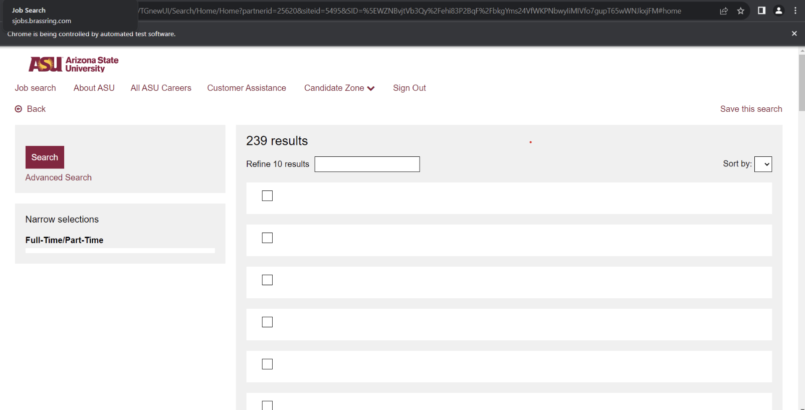
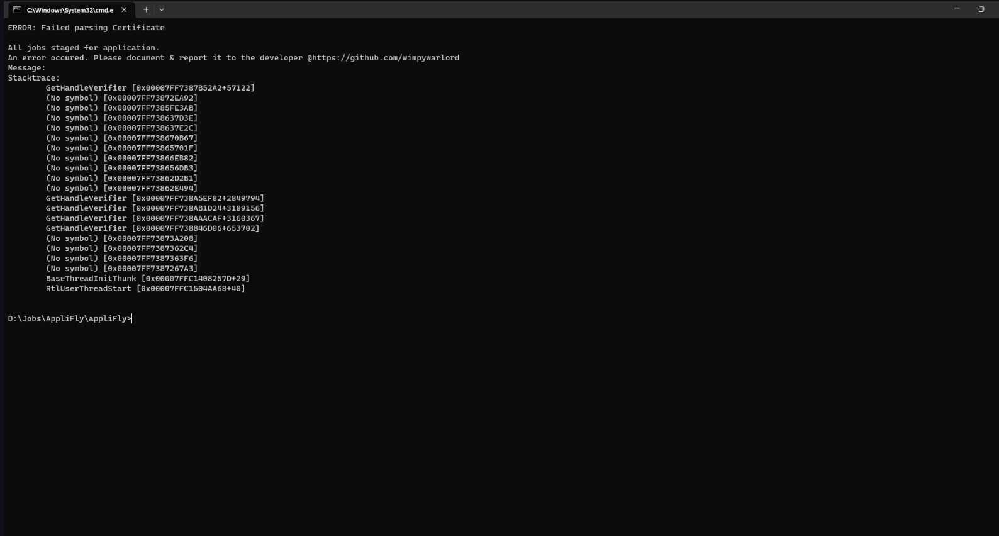

# Welcome to AppliFLY

**Do something better with your time.**

Link to the website: https://kshitijdhyani.com/appliFLY/

This python script will fill **ALL** the jobs listed on the [ASU on campus job portal](https://students.asu.edu/employment/search) automatically. Just let the script run for 30 mins.

# How to run the script.

1. Visit the [appliFLY](https://kshitijdhyani.com/appliFLY/) website.
2. Download the script file (Connect with me as well, while you are at it 😉).
3. `Unzip` the file. This will create a `appliFly` folder containing 3 files inside. Namely `requirements.txt`, `appliFly.py`, and `env.txt`.
4. Create a `.env` file within the `appliFly` folder, and copy all the content from the `env.txt` file into the `.env` file.
5. Fill the details asked in the `.env` file.
6. Run: `pip install -r requirements.txt` to install all dependency. This command must be execute while you are present in the `appliFly` directory. If you face any difficulties in this step, please open a issue [here](https://github.com/wimpywarlord/appliFLY/issues), I will be sure to assist you.
7. Run: `python appliFly.py` to start the script.

# Known Issue and Fix.

If you face any of the following issues:

- The script stopped executing and threw a "stale element reference" exception.
- There are 0 jobs available for you to apply.
- Script runs initially, then gets stuck on the job loading screen.

- 

- 

The FIX is [here](https://github.com/wimpywarlord/appliFLY/issues/9).

**Checklist before running the script:**

- [ ] Make sure you installed all the dependencies: `pip install -r requirements.txt`
- [ ] Make sure have created a `.env` file in the same directory as this script.
- [ ] Make sure have copied contents of the `env.txt` file into that `.env`.
- [ ] Make sure have filled the `.env` file with your credentials and paths.
- [ ] Make sure you have a good internet connection.
- [ ] Make sure you have applied to atleast 1 job on the portal manually.

After the script starts, it will ask the you to **one time** authorise the DUO double authentication. Authorize that and let the script run until it fills up all the available job listing.

If you have any doubts or questions. Please create a issue [here](https://github.com/wimpywarlord/appliFLY/issues), and I will make sure to answer it.

## NOTICE

- Apply to at-least 1 job opening manually before running the script
- You will need to 1 time authenticate using DUO. Make sure you have your phone with you.
- If the script crashes for any reason. Simply Restart It. It will work the next time, give it a few tries.
- In case of errror/crash, document the error and report to the developer @https://github.com/wimpywarlord/appliFLY/issues.
- If you have already applied for a job, the script will skip it.

## FAQ

**-> Does this program store any credentials?**

No appliFLY does not store any credential or any user information for that matter. It is a simple script that you run independently on your local machine.

**-> Does the program upload any supplemental material files while applying to a position?**

As of 9th September 2023, the script does not upload any supplemental material while applying to a position. However, this feature can be expected soon.

**-> Can the script apply to positions using different resumes and cover letters?**

Currently (as of 9th September 2023) if you run a script specifying the resume and cover letter, it will upload the same resume and cover letter to all the job positions. There is no flexibility to customize resume's and cover letter's for each job posting. However that feature can be expected soon enough.

If you want to apply using a new resume or cover letter, you will need to restart the script after updating the `path` in the `.env` file.

**-> Does the script re-apply to already applied positions?**

No, if you have already applied to some position, the program will simply skip that job opening and move on to the next listing.

## Trouble Shooting

- Make sure you have a good internet connection before running the script.

- Make sure you have applied to at least one job position on the job portal, before running the script. Otherwise, the script **will** fail. The script assumes you have applied to at least one job before. Hence this program does not fill all the fields. Instead only the ones that are not prefilled while applying.

- Sometimes certain components (Eg: submit button) within the ASU job portal, fail to load properly. As a result the script is unable to detect the component. This may result in failure. In such cases, simply restart the script, and you should be fine. Script will not re-apply to already applied jobs positions.

## Made By

Made with ❤️ By @Kshitij Dhyani

**Here are my Socials**:
Linkedin: https://www.linkedin.com/in/kshitijdhyani/

Twitter: https://twitter.com/kshitij_dhyani

Portfolio Website: https://kshitijdhyani.com/

Github: https://github.com/wimpywarlord/
